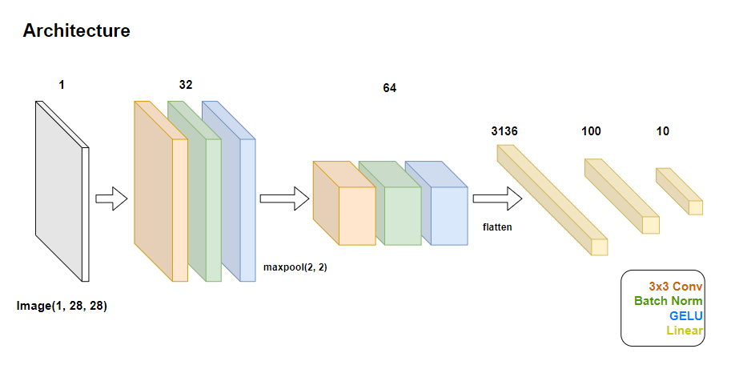
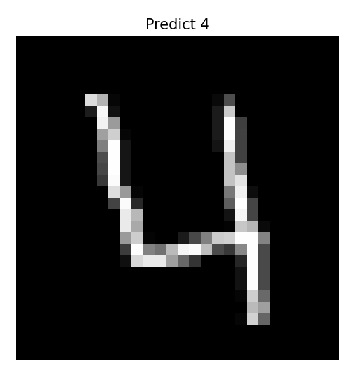

# ConvNet-for-MNIST
```
All code has been written by Doby.
© 2024 Doby. All rights reserved.
```
## Description
<b><i>
* MNIST Classification using Convolutional Network
* Motivation: 나는 코드를 짤 수 있는 사람일까
* Project Duration: 24/06/06 15:35~19:20 (3H 45M)
* Author: Doby
</b></i>

## Architecture
### 1. Architecture


### 2. Weight Initialization
```
No Initialization (Random, torch.empty)
Accuracy: 97.19%, Test Loss: 0.0929

Weight Initialization (Gaussian Distribution)
Accuracy: 95.17%, Test Loss: 0.1534

Weight Initialization (Xavier)
Accuracy: 97.66%, Test Loss: 0.0770
```

## Usage
### Download Repository
```
# 프로젝트 Clone
git clone https://github.com/drawcodeboy/ConvNet-for-MNIST.git

# 프로젝트 위치로 이동
cd Path1/Path2/ConvNet-for-MNIST
```
### Virtual Environment
```
# 가상환경 만들기
python -m venv .venv

# 가상환경 활성화
.venv\Scripts\activate

# 가상환경에서 패키지 설치
pip install -r requirements.txt
```
### Train
```
# main.py를 실행시켜 아래와 같은 세팅으로 학습시킨 후
# trained_1epoch_convnet.pt라는 이름 파일로 모델 저장

python main.py --mode=train --epochs=1 --lr=1e-4 --batch_size=16 --device=cpu --file_name=trained_1epoch_convnet.pt
```
### Test
```
# trained_1epoch_convnet.pt 모델을 불러와서 데이터셋 샘플을
# --index를 통해 설정하여 해당 샘플에 대한 predict 결과 확인

python main.py --mode=inference --device=cpu --file_name=trained_1epoch_convnet.pt --index=0
```

## Example
